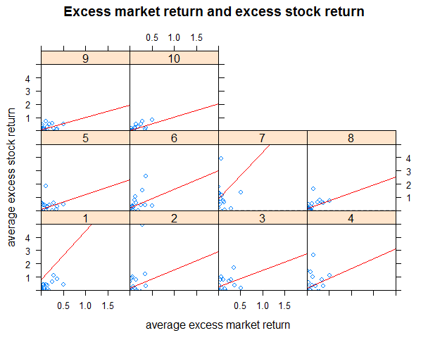

[](http://quantlet.de/index.php?p=info)

## [](http://quantlet.de/) **SPL_SP500int_CAPM Regression** [](http://quantlet.de/d3/ia)

```yaml

Name of QuantLet: SPL_SP500int_CAPM Regression 

Published in: Github

Description: 'regresses average excess stock return on average excess market 
return (Data: price of 10 Internet and Software stocks in S&P500 and S&P500 
index, time period: 2015/05/01-2016/04/25) using seemingly unrelated regression 
and tests whether the intercepts are jointly zeros so as to figure out whether 
CAPM model is fitted in our situation.'

Keywords : 'financial, portfolio, simulation, returns, estimation, asset, 
regression, empirical, CAPM model' 

See also: SPL_SP500int_Panel Data Analysis

Author : Wei Zhang, Yue Wang, Fan Song, Jinhua Yang

Datafile : Panel.csv, Capm1.csv, CAPM.csv

```



```r

# clear history
rm(list = ls(all = TRUE))
graphics.off()

#set working directory
#setwd("...")

# Install packages if not installed
libraries = c("stargazer", "gplots", "lattice", "zoo", "car", "Matrix", "lmtest", "systemfit")
lapply(libraries, function(x) if (!(x %in% installed.packages())) {
    install.packages(x)
})

# Load packages
lapply(libraries, library, quietly = TRUE, character.only = TRUE)

#read data
Paneldata = read.csv("Panel.csv")
Ri = Paneldata$Ri
Rm = Paneldata$Rm
com = factor(Paneldata$company)
summary(Paneldata$Ri)
summary(Paneldata$Rm)

# Seemingly Unrelated Regression for CAPM
Capm = read.csv("CAPM.csv")

# Description of Data
Google = Capm$Google
Ebay = Capm$Ebay
Facebook = Capm$Facebook
Yahoo = Capm$Yahoo
WU = Capm$WU
Verisign = Capm$Verisign
Netflix = Capm$netflix
TSS = Capm$TSS
FNI = Capm$FNI
ADP = Capm$ADP
amer = Capm$amer
xyplot(aser ~ amer | com, data = Paneldata, panel = function(x, y) {
    panel.xyplot(x, y)
    panel.abline(h = median(y), lty = 2, col = "gray")
    panel.lmline(x, y, col = "red")
}, xlab = "average excess market return", ylab = "average excess stock return", xlim = c(0, 
    2), ylim = c(0, 5), main = "Excess market return and excess stock return")

# drop company 7, which is Netflix, since its intercept is much higher than 0.  CAPM
# regression using SUR
eq1 = Google ~ amer
eq2 = Ebay ~ amer
eq3 = Facebook ~ amer
eq4 = Yahoo ~ amer
eq5 = WU ~ amer
eq6 = Verisign ~ amer

eq8 = TSS ~ amer
eq9 = FNI ~ amer
eq10 = ADP ~ amer
system = list(eq1 = eq1, eq2 = eq2, eq3 = eq3, eq4 = eq4, eq5 = eq5, eq6 = eq6, eq8 = eq8, 
    eq9 = eq9, eq10 = eq10)


sur = systemfit(system, method = "SUR", data = Capm)
summary(sur)


a = lm(Google ~ amer)
summary(a)
stargazer(a, title = "SUR for Google")

b = lm(Ebay ~ amer)
summary(b)
stargazer(b, title = "SUR for Ebay")

c = lm(Facebook ~ amer)
summary(c)
stargazer(c, title = "SUR for Facebook")

d = lm(Yahoo ~ amer)
summary(d)
stargazer(d, title = "SUR for Yahoo")

e = lm(WU ~ amer)
summary(e)
stargazer(e, title = "SUR for WU")

f = lm(Verisign ~ amer)
summary(f)
stargazer(f, title = "SUR for Verisign")

g = lm(TSS ~ amer)
summary(g)
stargazer(g, title = "SUR for TSS")

h = lm(FNI ~ amer)
summary(h)
stargazer(h, title = "SUR for FNI")

i = lm(ADP ~ amer)
summary(i)
stargazer(i, title = "SUR for ADP")

# Testing for CAPM
Capm1 = read.csv("Capm1.csv")
alphas = c(0.775619, 0.16526, 0.264861, 0.1504512, 0.0638014, 0.2031565, 0.1514792, 0.0508795, 
    0.0368303)
sig.hat = sur$residCov
sample.sr = function(x) {
    mu = mean(x)
    sg = sd(x)
    return(mu/sg)
}
amer = Capm1$amer
mkt.sr = sample.sr(amer)
GRS.stat = t(alphas) %*% solve(sig.hat, (alphas))/(1 + mkt.sr^2)
T = 52
N = 9
F.stat = T * (T - N - 1) * GRS.stat/(N * (T - 2))
p.val = pf(F.stat, N, T - N - 1, 0, lower.tail = F)
p.val

```
