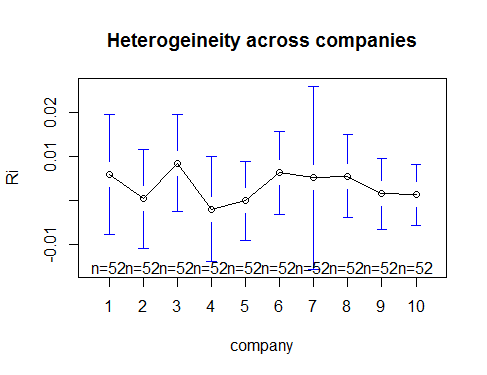
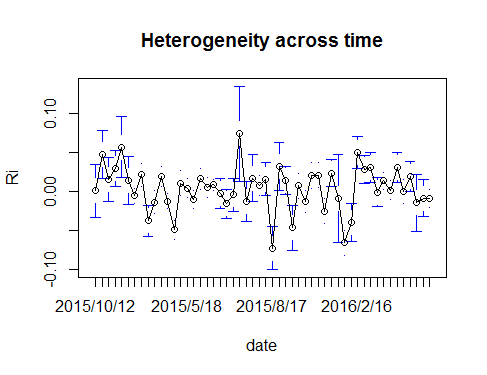
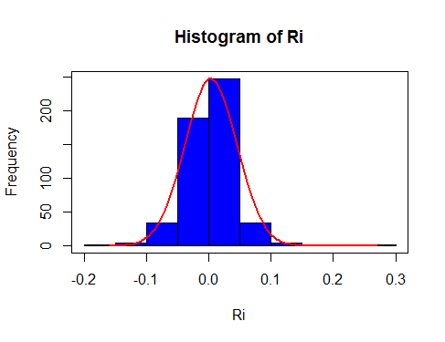
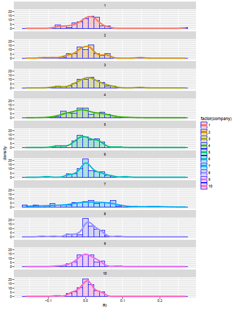

[](http://quantlet.de/index.php?p=info)

## [](http://quantlet.de/) **SPL_SP500int_Data Description** [](http://quantlet.de/d3/ia)

```yaml

Name of QuantLet: SPL_SP500int_Data Description

Published in: has not been published

Description: 'uses related commands to get data summary, distribution and variances for data 
of each company, also analyzes the heterogeneity across companies and over time.'

Keywords: data description, graphical representation, heterogeneity, return, plot

See also: SPL_SP500int_Panel Data Analysis, SPL_SP500int_CAPM Regression

Author: Wei Zhang, Yue Wang, Jinhua Yang, Fan Song

Datafile: Panel.csv

Output: data summary, plots

Example: data summary and plot of heterogeneity across companies

```






```r
# clear history
rm(list = ls(all = TRUE))
graphics.off()

# set working directory 
# setwd('...')

Paneldata = read.csv("Panel.csv")
# *data description analysis *plot graphics (use different color for different companies)
Ri = Paneldata$Ri
Rm = Paneldata$Rm
summary(Paneldata$Ri)
summary(Paneldata$Rm)

# install.packages('stargazer')
library("stargazer")
stargazer(Paneldata)

# install.packages('ggplot2')
library(ggplot2)
p = ggplot(Paneldata, aes(x = Rm,y = Ri,colours = factor(company)))
p + geom_point(aes(colour = factor(company))) + stat_smooth()

# install.packages('gplots')
library(gplots)
plotmeans(Ri ~ company, main = "Heterogeineity across companies", data = Paneldata)
plotmeans(Ri ~ date, n.label = FALSE, main = "Heterogeneity across time", data = Paneldata)

# *Histograms with norm density use hist() for market price
h = hist(Ri, breaks = 10, col = "blue")
xfit = seq(min(Ri), max(Ri), length = 100)
yfit = dnorm(xfit, mean = mean(Ri), sd = sd(Ri))
yfit = yfit * diff(h$mids[1:2]) * length(Ri)
lines(xfit, yfit, col = "red", lwd = 2)
box()

# use ggplot2 for individual company
p = ggplot(Paneldata, aes(x = Ri))
p + geom_histogram(aes(fill = factor(company), y = ..density..), alpha = 0.3, colour = "blue") + 
    stat_density(geom = "line", position = "identity", size = 1.5, aes(colour = factor(company))) + 
    facet_wrap(~company, ncol = 1)
```
