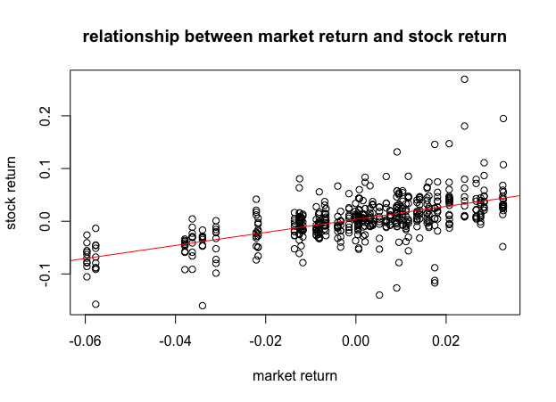
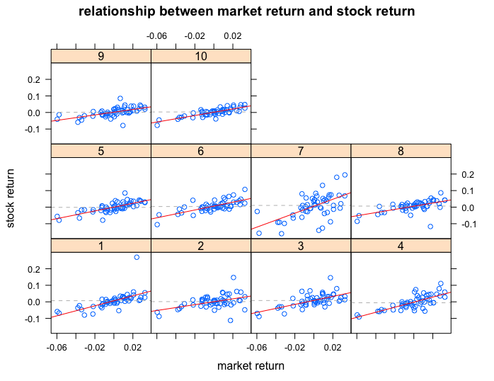

[](http://quantlet.de/index.php?p=info)

## [](http://quantlet.de/) **SPL_SP500int_Panel Data Analysis** [](http://quantlet.de/d3/ia)

```yaml

Name of QuantLet: SPL_SP500int_Panel Data Analysis

Published in: GitHub

Description: 'Runs pooled regression of stock returns on the market return in order to see 
in which direction the return of stocks in internet and software industry moves with respect 
to the whole market, and tests whether the error term has heterogeneous variance and serial 
correlations. Uses robust variance and run the regression again.'

Keywords: financial, returns, regression, empirical, panel-analysis 

See also: SPL_SP500int_Data Description, SPL_SP500int_CAPM Regression

Author: Wei Zhang, Yue Wang, Jinhua Yang, Fan Song

Datafile: Panel.csv

Output: data summary, plots

Example: scatterplot of the data and regression results.

```






```r

# clear history
rm(list = ls(all = TRUE))
graphics.off()

# set working directory 
# setwd('...')

# Install packages if not installed
libraries = c("Formula", "plm", "stargazer", "lmtest", "zoo", "MASS", "apsrtable"
              , "car", "lattice")
lapply(libraries, function(x) if (!(x %in% installed.packages())) {
  install.packages(x)
})

# Load packages
lapply(libraries, library, quietly = TRUE, character.only = TRUE)


# Panel Data Analysis

# Pooled Regression Model
Paneldata = read.csv("Panel.csv")
Ri = Paneldata$Ri
Rm = Paneldata$Rm
pooling = plm(Ri ~ Rm, data = Paneldata, index = c("company", "date"), model = "pooling")
summary(pooling)
stargazer(pooling, title = "Pooled Regression Results")

plot(Ri ~ Rm, data = Paneldata, main = "relationship between market return and stock return", 
    xlab = "market return", ylab = "stock return")
model = lm(Ri ~ Rm)
abline(model, col = "red")

# Fixed Effect Regression
com = factor(Paneldata$company)
xyplot(Ri ~ Rm | com, data = Paneldata, layout = c(10, 1), xlab = "market return", 
       ylab = "stock return", main = "stock return and market return")
xyplot(Ri ~ Rm | com, data = Paneldata, panel = function(x, y) {
  panel.xyplot(x, y)
  panel.abline(h = median(y), lty = 2, col = "gray")
  panel.lmline(x, y, col = "red")
}, xlab = "market return", ylab = "stock return", main = "Stock Return and Market Return of 10 Companies")

#Using Dummy Variables
fixed.dum = lm(Ri ~ Rm + factor(com) - 1, data = Paneldata)
summary(fixed.dum)
stargazer((fixed.dum), title = "Fixed Effects Regression Using Dummy Variables")
yhat = fixed.dum$fitted.values
scatterplot(yhat ~ Rm | Paneldata$company, boxplots = FALSE, xlab = "Market price", 
            ylab = "yhat", smooth = FALSE)
abline(lm(Ri ~ Rm), lwd = 3, col = "Dark Blue")

# Using plm
fixed = plm(Ri ~ Rm, data = Paneldata, index = c("company", "date"), model = "within")
summary(fixed)
stargazer(fixed, title = "Fixed Effects Regression Using plm")

# Testing for Fixed Effects
test_fixed = pFtest(fixed, pooling)
stargazer(test_fixed)

# Random Effect Regression
random = plm(Ri ~ Rm, data = Paneldata, index = c("company", "date"), model = "random")
summary(random)
stargazer((random), title = "Random Effects Regression")

# Test for the Difference between Fixed Effect Model and Random Effect Model (Hausman test)
phtest(fixed, random)

# Comparison of Random Effects Model and Pooled Regression Model (LM test)
plmtest(pooling)

```
