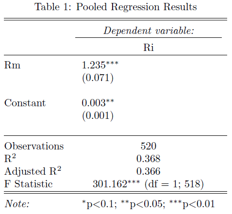
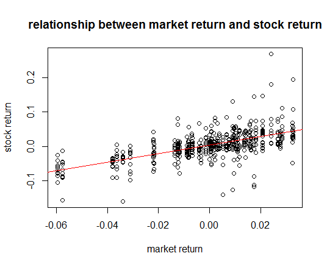
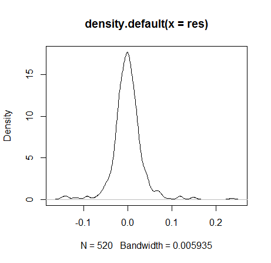
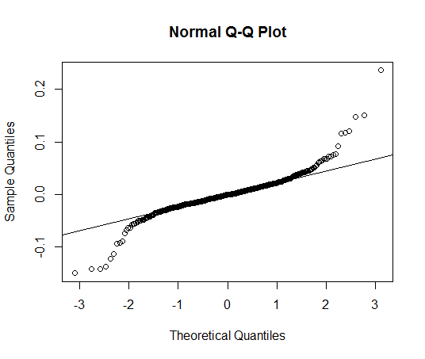

[](http://quantlet.de/index.php?p=info)

## [](http://quantlet.de/) **SPL_SP500int_Panel Data Analysis** [](http://quantlet.de/d3/ia)

```yaml

Name of QuantLet: SPL_SP500int_Panel Data Analysis

Published in: has not been published

Description: 'In order to see in which direction is the return of stocks in internet 
and software industry moves with respect to the whole market, we run pooled regression 
of these stock returns on the market return,  and test whether the error terms has 
heterogeneous variance and serial correlations. Also we use robust variance and run 
the regression again.'

See also: SPL_SP500int_Data Description, SPL_SP500int_CAPM Regression

Author: Wei Zhang, Yue Wang, Jinhua Yang, Fan Song

Datafile: Panel.csv

Output: data summary, plots

Example: scatterplot of the data and regression results.

```







```r
# clear history
rm(list = ls(all = TRUE))
graphics.off()

# set working directory setwd('...')

# Panel Data Analysis

# Pooled Regression Model

# regression

# install.packages('Formula') install.packages('plm') install.packages('stargazer')
library(Formula)
library(plm)
library(stargazer)
Paneldata = read.csv("Panel.csv")
Ri = Paneldata$Ri
Rm = Paneldata$Rm
pooling = plm(Ri ~ Rm, data = Paneldata, index = c("company", "date"), model = "pooling")
summary(pooling)
stargazer(pooling, title = "Pooled Regression Results")

plot(Ri ~ Rm, data = Paneldata, main = "relationship between market return and stock return", 
    xlab = "market return", ylab = "stock return")
model = lm(Ri ~ Rm)
abline(model, col = "red")

# Residual Analysis Empirical Density of Residuals

res = pooling$resid
dens_res = density(res)
plot(dens_res)
plot(res, ylab = "residuals(pooling)")
qqnorm(res)
qqline(res)
# normality assumption is satiesfied

# Residuals and Explanatory Variable
par(mfrow = c(1, 1))
plot(Paneldata$Rm, res)
model1 = lm(res ~ Paneldata$Rm)
abline(model1, col = "red")

y_pred = predict(pooling)
plot(y_pred, res)
model2 = lm(res ~ y_pred)
abline(model2, col = "blue")

# heterogeneity testing install.packages('lmtest') install.packages('zoo')
library(zoo)
library(lmtest)
bptest(pooling)

# serial correlation testing
pbgtest(pooling)

# Use Robust Regression install.packages(('MASS'))
library(MASS)
rols = rlm(Ri ~ Rm)
summary(rols)
stargazer(rols, title = "Robust OLS Results", align = TRUE)

# install.packages('apsrtable')
library(apsrtable)
OLS = lm(Ri ~ Rm)
coefficients(OLS)
coefficients(rols)
stargazer(OLS, rols, title = "regression of standard OLS and robust OLS")

```
