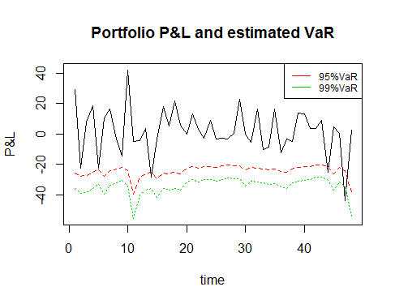

[](http://quantlet.de/index.php?p=info)

## [](http://quantlet.de/) **SPL_SP500int_VaR** [](http://quantlet.de/d3/ia)

```yaml

Name of QuantLet: SPL_SP500int_VaR

Published in: has not been published

Description: 'Uses DCC model to estimate the variance covariance matrix of returns of 
10 Internet and Software stocks in S&P500 (time period: 2015/05/01-2016/04/25, rolling 
window: 200 days), computes 95% and 99% VaR of a value weighed portfolio containing 
these stocks from estimation results. Assumes that every stock has autocorrelation and 
ARCH effect.'

Keywords: 'VaR, arma, garch, plot, graphical representation, time-series, volatility, 
risk measure, portfolio, financial'

See also: SPL_SP500int_tsplot, SPL_SP500int_test

Author: Jinhua Yang, Fan Song

Datafile: data_stock.csv

Output: estimated 95%VaR and 99%VaR of the portfolio

Example: The plot illustrates the portfolio profit and loss (P&L) and estimated 95%VaR and 99%VaR

```



```r
# clear history
rm(list = ls(all = TRUE))
graphics.off()

# set working directory
#setwd("...")

# import data
stock = as.data.frame(read.csv("data_stock.csv", header = T, sep = ","))

# get daily return of each stock
price = stock[, 2:11]
value = matrix(stock[, 12], nrow = T)
T = nrow(price)
n = ncol(price)

return = log(price[2, ]/price[1, ])
for (j in 2:(T - 1)) {
    return[j, ] = log(price[j + 1, ]/price[j, ])
}

# install.packages('ccgarch') install.packages('tseries')
library("tseries")
library("ccgarch")

# define portfolio: a value weighted portfolio containing one unit of each stock
W = matrix(unlist(price[1, ]/value[1, ]), nrow = n, ncol = 1)
alpha95 = 1.65
alpha99 = 2.33

# use AR(1) model to get the residual of stock use time interval t=200, there are
# 247-200+1=48 intervals(T-t)

t = 200

VaR95 = matrix(, nrow = T - t, ncol = 1)
VaR99 = matrix(, nrow = T - t, ncol = 1)

for (j in 1:(T - t)) {
    
    ts = return[j:(j + t - 1), ]
    
    residual = matrix(, nrow = t, ncol = n)
    
    for (i in 1:n) {
        residual[, i] = matrix(residuals(arma(ts[, i], order = c(1, 0))))
    }
    
    residual = residual[-1, ]
    
    coef = matrix(, nrow = n, ncol = 3)
    
    # initial GARCH model estimation
    for (i in 1:10) {
        coef[i, ] = matrix(coef(garch(residual[, i], order = c(1, 1), series = NULL)))
        
    }
    
    # DCC-GARCH model estimation
    a = coef[, 1]
    A = diag(coef[, 2])
    B = diag(coef[, 3])
    dcc.para = c(0.01, 0.97)
    results = dcc.estimation(inia = a, iniA = A, iniB = B, ini.dcc = dcc.para, dvar = residual, 
        model = "diagonal")
    h = results$h
    dcc = results$DCC
    v = sqrt(diag(h[t - 1, ]))
    R = matrix(data = dcc[1, ], nrow = n, ncol = n)
    H = v %*% R %*% v
    
    VaR95[j, ] = sqrt(t(W) %*% H %*% W) * alpha95 * value[j]
    VaR99[j, ] = sqrt(t(W) %*% H %*% W) * alpha99 * value[j]
    
}

VaR = cbind(VaR95, VaR99)

# profit&loss
value = matrix(value, nrow = T)
PL = value[(t + 1):T, ] - value[t:(T - 1), ]


bt = cbind(PL, -VaR)
colnames(bt) = c("PL", "95%VaR", "99%VaR")
matplot(c(1:(T - t)), bt[, 1:3], type = "l", xlab = "time", ylab = "P&L")
legend("topright", colnames(bt)[-1], lwd = 1, col = 2:3, cex = 0.75)
title("Portfolio P&L and estimated VaR")

```
