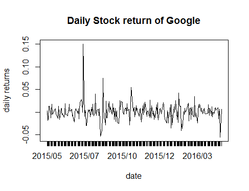
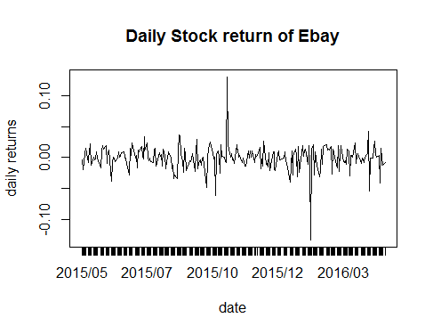

[](http://quantlet.de/index.php?p=info)

## [](http://quantlet.de/) **SPL_SP500int_tsplot** [](http://quantlet.de/d3/ia)

```yaml

Name of QuantLet: SPL_SP500int_tsplot

Published in: GitHub

Description: Shows daily returns of 10 Internet and Software stocks in S&P500 from 2015/05/01 to 2016/04/25.

Keywords: plot, graphical representation, time-series, portfolio, financial, returns

See also: SPL_SP500int_VaR, SPL_SP500int_test

Author: Jinhua Yang, Fan Song, Yue Wang, Wei Zhang

Datafile: data_stock.csv

Example: plots of daily returns of these 10 stocks

```

 
 

```r

# clear history
rm(list = ls(all = TRUE))
graphics.off()

# set working directory
#setwd("...")

# import data
stock = as.data.frame(read.csv("data_stock.csv", header = T, sep = ","))


# get daily return of each stock
price = stock[, 2:11]
value = matrix(stock[, 12], nrow = T)
date= stock[2:248, 1]
T = nrow(price)

return = log(price[2, ]/price[1, ])
for (j in 2:(T - 1)) {
    return[j, ] = log(price[j + 1, ]/price[j, ])
}
row=as.numeric(nrow(return))

# plot the return of every stock against date

plot(return$GOOGL, type = "l", ylab = "daily returns", xaxt = "n", main = "Daily Stock return of Google")
axis(1, at = c(1:row), labels = date, las = 0)

plot(return$EBAY, type = "l", ylab = "daily returns", xaxt = "n", main = "Daily Stock return of Ebay")
axis(1, at = c(1:row), labels = date, las = 0)

plot(return$FB, type = "l", ylab = "daily returns", xaxt = "n", main = "Daily Stock return of Facebook")
axis(1, at = c(1:row), labels = date, las = 0)

plot(return$YHOO, type = "l", ylab = "daily returns", xaxt = "n", main = "Daily Stock return of Yahoo")
axis(1, at = c(1:row), labels = date, las = 0)

plot(return$WU, type = "l", ylab = "daily returns", xaxt = "n", main = "Daily Stock return of Wester Union")
axis(1, at = c(1:row), labels = date, las = 0)

plot(return$VRSN, type = "l", ylab = "daily returns", xaxt = "n", main = "Daily Stock return of Verisign Inc.")
axis(1, at = c(1:row), labels = date, las = 0)

plot(return$NFLX, type = "l", ylab = "daily returns", xaxt = "n", main = "Daily Stock return of Netflix Inc.")
axis(1, at = c(1:row), labels = date, las = 0)

plot(return$TSS, type = "l", ylab = "daily returns", xaxt = "n", main = "Daily Stock return of Total System Service")
axis(1, at = c(1:row), labels = date, las = 0)

plot(return$FIS, type = "l", ylab = "daily returns", xaxt = "n", main = "Daily Stock return of Fidelity National Information Services")
axis(1, at = c(1:row), labels = date, las = 0)

plot(return$ADP, type = "l", ylab = "daily returns", xaxt = "n", main = "Daily Stock return of Automatic Data Processing")
axis(1, at = c(1:row), labels = date, las = 0)

```
